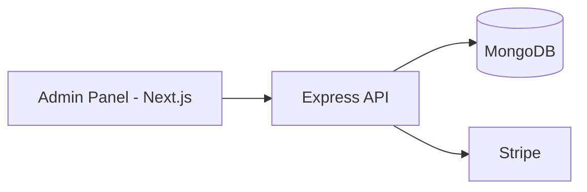
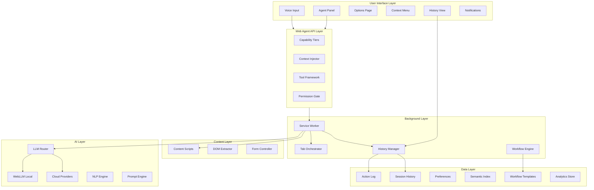

# MirmirOps: Unified Browser Intent Engine

## Vision

MirmirOps is a browser-native AI assistant that transforms how users interact with the web. It provides voice-driven commands, cross-site automation, and intelligent memory while keeping users in complete control of their data and privacy.

---

## Subscription Plans

### Plan Comparison

| Feature                       | Free               | Pro              | Enterprise                   |
| ----------------------------- | ------------------ | ---------------- | ---------------------------- |
| **WebLLM (Local Inference)**  | Unlimited          | Unlimited        | Unlimited                    |
| **Cloud LLM Requests**        | 50/month           | 2,000/month      | Custom limit                 |
| **BYOK (Bring Your Own Key)** | 100 requests/month | Unlimited        | Unlimited                    |
| **Shadow Tabs**               | 2 concurrent       | 6 concurrent     | Custom limit                 |
| **Workflow Templates**        | 3 saved            | Unlimited        | Unlimited                    |
| **Scheduled Workflows**       | Not available      | 5 active         | Unlimited                    |
| **History Retention**         | 7 days             | 90 days          | Custom/Unlimited             |
| **Semantic Memory**           | 1,000 entries      | 50,000 entries   | Unlimited                    |
| **Voice Commands**            | 20/day             | Unlimited        | Unlimited                    |
| **Priority Support**          | Community only     | Email support    | Dedicated support            |
| **Analytics Dashboard**       | Basic              | Full             | Full + Custom reports        |
| **API Access**                | Not available      | Not available    | Full API access              |
| **Team Features**             | Not available      | Not available    | Multi-user, shared workflows |
| **Custom Branding**           | Not available      | Not available    | White-label option           |
| **Trial Period**              | -                  | 3-day free trial | Custom trial                 |

### Free Plan Details

The Free plan provides a fully functional experience with local-first AI:

**Included**

- Unlimited WebLLM local inference (no cloud costs)
- 50 cloud LLM requests per month (for complex tasks)
- 100 BYOK requests per month (use your own API keys)
- Basic voice commands (20 per day)
- 2 concurrent shadow tabs for cross-site tasks
- 3 workflow templates saved
- 7-day history retention
- 1,000 semantic memory entries
- Basic analytics (usage counts only)
- Community support via forums/Discord

**Limitations**

- No scheduled workflows
- Limited history and memory
- No priority processing
- Watermark on exported reports

### Pro Plan Details

Pro unlocks the full power of MirmirOps for individual power users:

**Everything in Free, plus:**

- 2,000 cloud LLM requests per month
- Unlimited BYOK requests
- Unlimited voice commands
- 6 concurrent shadow tabs
- Unlimited workflow templates
- 5 scheduled/automated workflows
- 90-day history retention
- 50,000 semantic memory entries
- Full analytics dashboard with trends
- Export history to JSON/CSV/PDF
- Email support with 24-hour response
- Early access to new features

**Pricing**

- Monthly: Configurable by admin (default $9.99/month)
- Annual: Configurable by admin (default $99/year - 2 months free)
- 3-day free trial for new users

### Enterprise Plan Details

Enterprise provides maximum flexibility and control for organizations:

**Everything in Pro, plus:**

- Custom cloud LLM limits (set by admin)
- Custom shadow tab limits
- Unlimited scheduled workflows
- Custom history retention (including unlimited)
- Unlimited semantic memory
- Full API access for integrations
- Team features with shared workflows
- Role-based access control
- Custom branding/white-label option
- Dedicated account manager
- SLA with uptime guarantees
- On-premise deployment option
- SSO integration (SAML, OAuth)
- Audit logs and compliance reports
- Custom training and onboarding

**Pricing**

- Custom pricing based on seats and features
- Volume discounts available
- Annual contracts with quarterly billing option

---

## Admin Panel

### Overview

The Admin Panel is a supporting web application (not the main product) for managing users, subscriptions, pricing, and enterprise configuration.

### Admin Panel Architecture



### Admin Panel Features

**Core Features**

- User management (search, filter, view, assign plans)
- Plan and pricing configuration
- Enterprise account creation with custom limits
- Basic analytics dashboard
- Audit logging

### Admin Access Levels

| Role        | Capabilities                                                  |
| ----------- | ------------------------------------------------------------- |
| Super Admin | Full access to all features, can create other admins          |
| Admin       | User management, plan assignment, view analytics              |
| Support     | View user details, limited user management, no pricing access |
| Viewer      | Read-only access to dashboard and analytics                   |

---

## Backend Infrastructure

The backend is a supporting service. The primary focus is the browser extension (Unified Browser Intent Engine).

### Backend Components

**Express API (packages/api)**

- User authentication (JWT)
- Subscription management (Stripe integration)
- Usage tracking and limit enforcement
- License validation for Enterprise
- Admin endpoints for user/plan management

**MongoDB Database**

- Flexible document storage
- Supports MongoDB Atlas or self-hosted
- Collections: users, subscriptions, usage, licenses, audit

**Admin Panel (apps/admin)**

- Next.js (latest) dashboard
- User and plan management
- Analytics and reporting

---

## Usage Tracking and Limits

### Extension-Side (Primary)

- Track all usage locally in IndexedDB
- Sync with backend periodically (every 5 minutes)
- Cache limits and remaining counts locally
- Check limits before expensive operations
- Show warnings at 80% usage
- Block and prompt upgrade when limits exceeded
- Work offline with cached limits

### Limit Enforcement

| Action            | Behavior When Exceeded     |
| ----------------- | -------------------------- |
| Cloud LLM Request | Suggest WebLLM or upgrade  |
| BYOK Request      | Suggest upgrade            |
| Voice Command     | Show daily limit reached   |
| Shadow Tab        | Wait for existing to close |
| Save Workflow     | Suggest deleting old ones  |
| Schedule Workflow | Show Pro feature prompt    |

---

## Architecture Overview



---

## Technology Stack

### Monorepo and Build

- **Package Manager**: Yarn with workspaces
- **Build Orchestration**: Turborepo
- **Language**: TypeScript 5.x (strict mode) across all packages

### Extension (apps/extension) - PRIMARY FOCUS

- **Build System**: Vite 6+ with vite-plugin-web-extension
- **UI Framework**: React 19 with TailwindCSS
- **Cross-Browser**: webextension-polyfill with TypeScript types
- **Local Storage**: Dexie.js (IndexedDB wrapper)
- **State**: Zustand for global state management

### Admin Panel (apps/admin)

- **Framework**: Next.js (latest) with App Router
- **UI Components**: shadcn/ui with TailwindCSS
- **State Management**: TanStack Query
- **Tables**: TanStack Table
- **Charts**: Recharts
- **Auth**: NextAuth.js

### Backend API (packages/api)

- **Runtime**: Node.js 20+
- **Framework**: Express.js
- **Database**: MongoDB (Atlas or self-hosted)
- **ODM**: Mongoose
- **Cache**: Redis
- **Auth**: JWT with refresh tokens

### External Services

- **Payments**: Stripe (subscriptions, checkout)
- **Email**: Resend or SendGrid
- **Error Tracking**: Sentry

### AI and LLM (Extension)

- **Local Inference**: @mlc-ai/web-llm (WebGPU-accelerated)
- **Cloud Providers**: multi-llm-ts (OpenAI, Anthropic, Ollama, 10+ providers)
- **NLP Processing**: compromise (in-browser entity extraction)
- **Embeddings**: @xenova/transformers (local semantic search)

### Voice and Input (Extension)

- **Speech Recognition**: Web Speech API (SpeechRecognition)
- **Speech Synthesis**: Web Speech API (SpeechSynthesis)
- **Clipboard**: Clipboard API and Selection API

---

## Comprehensive History System

### History Data Model

The history system tracks every interaction, action, and workflow execution with full context for replay, analysis, and learning.

**Session History**

- Session ID and timestamps (start, end, duration)
- User commands issued during session
- Pages visited and actions taken
- LLM interactions and responses
- Final outcomes and user feedback

**Command History**

- Original user input (text or voice transcript)
- Parsed intent and extracted entities
- Confidence scores and alternatives considered
- Execution status and result summary

**Action Log**

- Every action performed by the agent
- Target URL, element, and action type
- Permission tier required and granted
- Timestamp and duration
- Success/failure status with error details
- Screenshots (optional, user-controlled)

**Workflow Execution History**

- Workflow template used (if any)
- Steps executed with individual outcomes
- Branches taken and decisions made
- Resources consumed (tokens, time, tabs)
- Final result and user satisfaction rating

### History Features

**Search and Filter**

- Full-text search across all history
- Filter by date range, action type, site, status
- Semantic search using embeddings
- Quick filters for common queries

**Timeline View**

- Chronological display of all activities
- Grouped by session or workflow
- Expandable details for each entry
- Visual indicators for success/failure/pending

**Replay and Debug**

- Step-by-step replay of any workflow
- Pause, inspect, and modify during replay
- Compare different execution runs
- Export for debugging or sharing

**Privacy Controls**

- Selective history deletion
- Auto-expiration settings (7 days, 30 days, etc.)
- Exclude specific sites from history
- Full history export and import
- Complete history wipe option

---

## Native Browser APIs

### Web Speech APIs

| API                  | Purpose         | Usage                                       |
| -------------------- | --------------- | ------------------------------------------- |
| SpeechRecognition    | Voice-to-text   | Push-to-talk commands, continuous dictation |
| SpeechSynthesis      | Text-to-speech  | Progress updates, confirmations, results    |
| SpeechSynthesisVoice | Voice selection | User-configurable voice preferences         |

### DOM Observation APIs

| API                  | Purpose              | Usage                           |
| -------------------- | -------------------- | ------------------------------- |
| MutationObserver     | Track DOM changes    | Dynamic content, SPA navigation |
| IntersectionObserver | Visibility detection | Lazy loading, scroll actions    |
| ResizeObserver       | Size changes         | Responsive adjustments          |

### Storage APIs

| API                  | Purpose           | Usage                                |
| -------------------- | ----------------- | ------------------------------------ |
| IndexedDB            | Structured data   | History, preferences, semantic index |
| chrome.storage.local | Extension data    | Settings, API keys                   |
| chrome.storage.sync  | Cross-device sync | Preferences across devices           |
| Cache API            | Model caching     | WebLLM weights                       |
| StorageManager       | Persistence       | Prevent data eviction                |

### Browser Extension APIs

| API                  | Purpose            | Usage                          |
| -------------------- | ------------------ | ------------------------------ |
| chrome.tabs          | Tab management     | Shadow tab orchestration       |
| chrome.scripting     | Script injection   | Runtime content scripts        |
| chrome.sidePanel     | Side panel UI      | Persistent agent interface     |
| chrome.contextMenus  | Right-click menus  | Contextual actions             |
| chrome.notifications | Desktop alerts     | Task completion, errors        |
| chrome.alarms        | Scheduled tasks    | Cleanup, sync                  |
| chrome.webNavigation | Navigation events  | Page tracking                  |
| chrome.history       | Browser history    | Semantic search (with consent) |
| chrome.commands      | Keyboard shortcuts | Quick access                   |

### Other Web APIs

| API                     | Purpose              | Usage                       |
| ----------------------- | -------------------- | --------------------------- |
| Clipboard API           | Read/write clipboard | Copy results, paste data    |
| Selection API           | Text selection       | Contextual commands         |
| fetch + AbortController | HTTP requests        | LLM calls with cancellation |
| ReadableStream          | Streaming            | Real-time LLM tokens        |
| Notification API        | Web notifications    | Background task alerts      |

---

## Third-Party Libraries

### NLP Processing (compromise)

- In-browser natural language processing (~250KB)
- Entity extraction: dates, prices, locations, people, organizations
- Intent classification from verbs and sentence structure
- Text normalization and cleaning
- Processes ~1MB text per second

### Local Embeddings (@xenova/transformers)

- Run transformer models in-browser
- Semantic similarity search
- all-MiniLM-L6-v2 model for embeddings
- No server required for semantic features

### IndexedDB (dexie + dexie-react-hooks)

- Simplified IndexedDB with reactive queries
- React hooks for live data binding
- Schema versioning and migrations
- High-performance bulk operations

---

## Project Structure

### Monorepo Structure (Yarn + Turborepo)

```
mirmir-ops/
├── apps/
│   ├── extension/              # Browser Extension (PRIMARY)
│   │   ├── src/
│   │   │   ├── background/
│   │   │   │   ├── index.ts
│   │   │   │   ├── orchestrator.ts
│   │   │   │   ├── permissions.ts
│   │   │   │   ├── history-manager.ts
│   │   │   │   ├── workflow-engine.ts
│   │   │   │   └── usage-tracker.ts
│   │   │   ├── content/
│   │   │   │   ├── index.ts
│   │   │   │   ├── extractor.ts
│   │   │   │   ├── controller.ts
│   │   │   │   └── observer.ts
│   │   │   ├── sidepanel/
│   │   │   │   ├── App.tsx
│   │   │   │   ├── components/
│   │   │   │   │   ├── Chat/
│   │   │   │   │   ├── History/
│   │   │   │   │   ├── Workflows/
│   │   │   │   │   ├── Subscription/
│   │   │   │   │   └── common/
│   │   │   │   ├── hooks/
│   │   │   │   └── store/
│   │   │   ├── options/
│   │   │   ├── lib/
│   │   │   │   ├── llm/
│   │   │   │   ├── web-agent/
│   │   │   │   ├── nlp/
│   │   │   │   ├── history/
│   │   │   │   ├── memory/
│   │   │   │   ├── voice/
│   │   │   │   ├── workflows/
│   │   │   │   ├── subscription/
│   │   │   │   ├── analytics/
│   │   │   │   ├── dom/
│   │   │   │   └── clipboard/
│   │   │   ├── shared/
│   │   │   └── manifest/
│   │   ├── public/
│   │   ├── tests/
│   │   └── vite.config.ts
│   │
│   └── admin/                  # Admin Panel (Next.js)
│       ├── src/
│       │   ├── app/
│       │   ├── components/
│       │   ├── lib/
│       │   └── hooks/
│       └── next.config.js
│
├── packages/
│   ├── api/                    # Express Backend
│   │   ├── src/
│   │   │   ├── routes/
│   │   │   ├── services/
│   │   │   ├── middleware/
│   │   │   ├── models/
│   │   │   └── index.ts
│   │   └── package.json
│   │
│   └── shared/                 # Shared Types
│       ├── src/
│       │   ├── types/
│       │   └── constants/
│       └── package.json
│
├── turbo.json
├── package.json
└── yarn.lock
```

---

## Phase 0: Infrastructure Setup

### 0.1 Monorepo Setup

- Initialize Yarn workspace with Turborepo
- Configure shared TypeScript configuration
- Set up ESLint and Prettier across all packages
- Configure turbo.json for build pipelines

### 0.2 Backend API (Express + MongoDB)

- Set up Express.js with TypeScript
- Configure MongoDB connection (supports Atlas or self-hosted)
- Set up Mongoose for data modeling
- Implement JWT authentication
- Stripe integration for payments
- Basic usage tracking endpoints

### 0.3 Admin Panel Foundation

- Set up Next.js (latest) admin application
- Implement admin authentication
- Basic dashboard with user stats
- Connect to Express API

---

## Phase 1: Foundation

### 1.1 Project Scaffolding

- Initialize Vite project with vite-plugin-web-extension
- Configure dual manifest generation for Chrome MV3 and Firefox MV3
- Set up TypeScript strict mode, ESLint, Prettier
- Install all required dependencies
- Configure TailwindCSS with custom design system

### 1.2 Background Service Worker

- Central message hub for all extension communication
- Permission tier enforcement (Tier 0-3)
- Tab lifecycle management and cleanup
- Request rate limiting and queuing
- Error handling and recovery

### 1.3 Content Script Infrastructure

- DOM context extraction using native APIs
- Structured data parsing (Schema.org, JSON-LD, Open Graph)
- MutationObserver for dynamic content detection
- IntersectionObserver for visibility tracking
- Form detection and field mapping
- Secure message passing with validation

### 1.4 Agent Panel (Sidepanel)

- React-based chat interface with markdown rendering
- Voice input with push-to-talk and visual feedback
- History sidebar with search and filters
- Workflow library access
- Settings quick access
- Progress indicators and status bar

### 1.5 LLM Integration Layer

- WebLLM for local inference (Llama 3, Phi 3, Mistral, Qwen)
- Cloud providers via multi-llm-ts (OpenAI, Anthropic, Ollama)
- BYOK support for any OpenAI-compatible endpoint
- Automatic fallback when local inference unavailable
- Token usage tracking per provider
- Streaming response handling

### 1.6 Web Agent API Framework

- Capability tier definitions and enforcement
- Context injection from page, preferences, and history
- Tool registration and execution framework
- Permission mediation with user approval

---

## Phase 2: History and Tracking

### 2.1 Action Logging System

- Immutable append-only action log
- Every action captured with full context
- Timestamps, targets, outcomes, and rationale
- Correlation IDs for multi-step workflows
- Severity levels (info, warning, error)

### 2.2 Session Management

- Automatic session creation and tracking
- Session metadata (duration, commands, outcomes)
- Session replay capability
- Cross-session context continuity

### 2.3 History Search and Filtering

- Full-text search across all history
- Date range filtering
- Action type filtering
- Site/domain filtering
- Status filtering (success, failure, pending)
- Semantic search using embeddings

### 2.4 History UI Components

- Timeline view with expandable entries
- Session grouping and navigation
- Action detail modal with full context
- Replay controls and step-through
- Export options (JSON, CSV, PDF)

### 2.5 Privacy and Retention

- Configurable auto-deletion (7d, 30d, 90d, never)
- Per-site exclusion rules
- Selective deletion of entries
- Full history export before deletion
- Encrypted local storage

---

## Phase 3: Voice and NLP

### 3.1 Voice Input System

- SpeechRecognition with push-to-talk
- Continuous mode for longer dictation
- Interim results for real-time feedback
- Multi-language support with detection
- Noise handling and error recovery
- Wake word detection (optional)

### 3.2 Voice Output System

- SpeechSynthesis for audio feedback
- Progress updates during long tasks
- Configurable voice, rate, and pitch
- Mute option with visual indicators
- Queue management for multiple utterances

### 3.3 NLP Intent Parsing

- Entity extraction (dates, prices, locations, people)
- Intent classification (book, search, compare, summarize)
- Slot filling for structured commands
- Text normalization and cleaning
- Confidence scoring

### 3.4 Voice Command Patterns

- Natural language command recognition
- Command aliases and shortcuts
- Context-aware command interpretation
- Disambiguation prompts when unclear

---

## Phase 4: Cross-Site Orchestration

### 4.1 Shadow Tab Management

- Background tab spawning and lifecycle
- Resource throttling to minimize impact
- Parallel execution across domains
- Tab cleanup after completion

### 4.2 Data Extraction

- Structured data parsers for common formats
- Table and list parsing to JSON
- Price comparison normalization
- Date and time standardization
- Image and media extraction

### 4.3 Form Interaction

- Field detection and smart labeling
- Auto-fill with preference data
- Event dispatching for validation
- CAPTCHA detection and user handoff
- Multi-step form handling

### 4.4 Result Aggregation

- Data deduplication across sources
- Ranking and sorting by relevance
- Unified result presentation
- Source attribution and linking

---

## Phase 5: Workflow System

### 5.1 Workflow Templates

- Save successful workflows as templates
- Parameterized templates with variables
- Template library with categories
- Import/export for sharing

### 5.2 Workflow Execution

- Step-by-step execution with logging
- Conditional branching based on results
- Error handling and retry logic
- Pause and resume capability
- Partial completion handling

### 5.3 Scheduled Workflows

- Time-based scheduling (daily, weekly)
- Event-triggered execution
- Notification on completion
- Failure alerts and retry

### 5.4 Workflow Sharing

- Export templates as JSON
- Import from file or URL
- Template validation and safety checks
- Version management

---

## Phase 6: Analytics and Insights

### 6.1 Usage Analytics

- Commands per day/week/month
- Most used features and workflows
- Success rate by action type
- Time saved estimates

### 6.2 Token and Cost Tracking

- Token usage by provider
- Cost estimation and alerts
- Budget limits and warnings
- Usage trends over time

### 6.3 Performance Metrics

- Execution time by workflow
- Error rates and common failures
- Page load impact
- Memory usage

### 6.4 Analytics Dashboard

- Visual charts and graphs
- Date range selection
- Export capabilities
- Privacy-respecting local-only analytics

---

## Phase 7: Trust and Control

### 7.1 Permission System

- Four-tier permission model (Passive, Read, Safe Mutable, Critical)
- Per-site allow/deny lists
- Time-bounded consent with expiration
- Permission history and audit
- Bulk permission management

### 7.2 Micro-Confirmations

- Step preview before execution
- Risk level indicators
- One-click approve/deny
- "Always allow" option per action type
- Batch confirmation for low-risk actions

### 7.3 Graceful Failure

- Site blocking detection
- Clear error explanations
- Manual fallback suggestions
- Retry with different approach
- Partial result delivery

### 7.4 Transparency

- Visible action indicators
- "What happened" summary
- Full audit trail access
- Export for external review

---

## Phase 8: Memory and Learning

### 8.1 Preference Memory

- Budget, dietary, seating, brand preferences
- Site-specific preferences
- Preference inference from behavior
- Conflict resolution

### 8.2 Semantic Memory

- Local vector store for embeddings
- Content summarization for storage
- Privacy-preserving indexing
- Fast similarity search

### 8.3 Context Memory

- Remember what user was doing on sites
- Cross-session context continuity
- Smart context retrieval
- Memory decay and relevance

### 8.4 Learning from Feedback

- Capture user corrections
- Improve intent parsing over time
- Personalized suggestions
- Workflow optimization hints

---

## Phase 9: User Experience

### 9.1 Onboarding

- Welcome tutorial with interactive demo
- Permission explanation and setup
- Preference wizard (budget, dietary, etc.)
- LLM provider configuration
- First task guided walkthrough

### 9.2 Keyboard Shortcuts

- Global shortcut to activate (Cmd/Ctrl + Shift + M)
- Voice input toggle (Cmd/Ctrl + Shift + V)
- History access (Cmd/Ctrl + Shift + H)
- Quick cancel (Escape)
- Customizable keybindings

### 9.3 Notification System

- Task completion notifications
- Error alerts with recovery options
- Proactive suggestions based on context
- Do not disturb mode
- Notification preferences

### 9.4 Accessibility

- Full keyboard navigation
- ARIA labels on all elements
- Screen reader announcements
- High contrast mode
- Reduced motion support
- Voice-only mode for visually impaired

### 9.5 Themes and Customization

- Light and dark mode
- System theme detection
- Custom accent colors
- Compact and comfortable density
- Font size adjustment

---

## Phase 10: Security and Privacy

### 10.1 Data Encryption

- Encrypted IndexedDB storage
- Secure API key storage
- No plain-text sensitive data

### 10.2 Privacy Controls

- Local-first by default
- Clear indication when data leaves device
- Selective data sharing controls
- Privacy mode (no history)

### 10.3 Security Features

- Content Security Policy compliance
- XSS protection in content scripts
- Sandboxed execution
- Regular security audits

### 10.4 Compliance

- GDPR-friendly data handling
- Data export for portability
- Right to deletion
- Transparent data practices

---

## Phase 11: Admin Panel

### 11.1 User Management

- User list with search and filters
- Manual plan assignment by email or credentials
- Account suspension and deletion

### 11.2 Plan and Pricing

- Edit plan features and limits
- Set Pro pricing
- Create coupon codes

### 11.3 Enterprise Management

- Create enterprise accounts with custom limits
- License key management

### 11.4 Analytics

- User growth and revenue overview
- Usage patterns summary

---

## Phase 12: Extension Subscription (Core Integration)

### 12.1 Authentication in Extension

- Login/signup modal
- Session persistence with JWT
- Auto-logout on token expiry

### 12.2 Plan Status Display

- Current plan indicator in UI
- Usage meters showing limits and remaining
- Contextual upgrade prompts when limits approached

### 12.3 Limit Enforcement (Critical)

- Pre-action limit checks before expensive operations
- Graceful degradation when limits exceeded
- Clear messaging with upgrade suggestions
- Offline limit caching for resilience
- Suggest WebLLM when cloud limits hit

### 12.4 Usage Tracking and Sync

- Track all usage locally in IndexedDB
- Background sync every 5 minutes
- Offline queue with sync on reconnect

---

## Key Features Summary

| Feature                 | Free      | Pro         | Enterprise    |
| ----------------------- | --------- | ----------- | ------------- |
| Voice Commands          | 20/day    | Unlimited   | Unlimited     |
| Cross-Site Automation   | 2 tabs    | 6 tabs      | Custom        |
| Local-First AI (WebLLM) | Unlimited | Unlimited   | Unlimited     |
| Cloud LLM Requests      | 50/month  | 2,000/month | Custom        |
| BYOK Requests           | 100/month | Unlimited   | Unlimited     |
| Comprehensive History   | 7 days    | 90 days     | Custom        |
| Workflow Templates      | 3 saved   | Unlimited   | Unlimited     |
| Scheduled Workflows     | -         | 5 active    | Unlimited     |
| Analytics Dashboard     | Basic     | Full        | Full + Custom |
| Semantic Memory         | 1,000     | 50,000      | Unlimited     |
| Team Features           | -         | -           | Yes           |
| API Access              | -         | -           | Yes           |
| Support                 | Community | Email       | Dedicated     |

---

## Success Metrics

**Product Metrics**

- Primary workflow completes in under 3 minutes
- Users can find and replay any past action
- Action history accurately reflects what agent did
- 90%+ task success rate
- Clear understanding of permissions at all times
- Zero data leakage without user consent

**Business Metrics**

- Free to Pro conversion rate > 5%
- Pro monthly churn rate < 5%
- Trial to paid conversion > 20%
- NPS score > 50
- Support ticket resolution < 24 hours

**Admin Panel Metrics**

- Admin response time < 2 seconds
- All actions logged in audit trail
- Zero unauthorized access incidents

---

## Build Commands

### Root (Yarn + Turborepo)

| Command      | Description                   |
| ------------ | ----------------------------- |
| yarn install | Install all dependencies      |
| yarn dev     | Run all apps in development   |
| yarn build   | Build all apps for production |
| yarn test    | Run all test suites           |
| yarn lint    | Lint all packages             |

### Extension (Primary Focus)

| Command                                | Description                  |
| -------------------------------------- | ---------------------------- |
| yarn workspace extension dev           | Development with hot reload  |
| yarn workspace extension build:chrome  | Production build for Chrome  |
| yarn workspace extension build:firefox | Production build for Firefox |
| yarn workspace extension build:all     | Build for both browsers      |
| yarn workspace extension test          | Run extension tests          |

### Admin Panel

| Command                    | Description             |
| -------------------------- | ----------------------- |
| yarn workspace admin dev   | Development server      |
| yarn workspace admin build | Production build        |
| yarn workspace admin start | Start production server |

### API (Express + MongoDB)

| Command                  | Description             |
| ------------------------ | ----------------------- |
| yarn workspace api dev   | Development server      |
| yarn workspace api build | Compile TypeScript      |
| yarn workspace api start | Start production server |

---

## Model Options

| Model           | Size   | Best For                        |
| --------------- | ------ | ------------------------------- |
| Qwen2-0.5B      | ~0.5GB | Ultra-fast, basic tasks         |
| Phi-3-mini-4k   | ~2.3GB | Fast responses, simple tasks    |
| Llama-3.1-8B-q4 | ~4.5GB | High quality, complex reasoning |

Users select preferred model in Options. Extension falls back to cloud providers if WebGPU unavailable.
